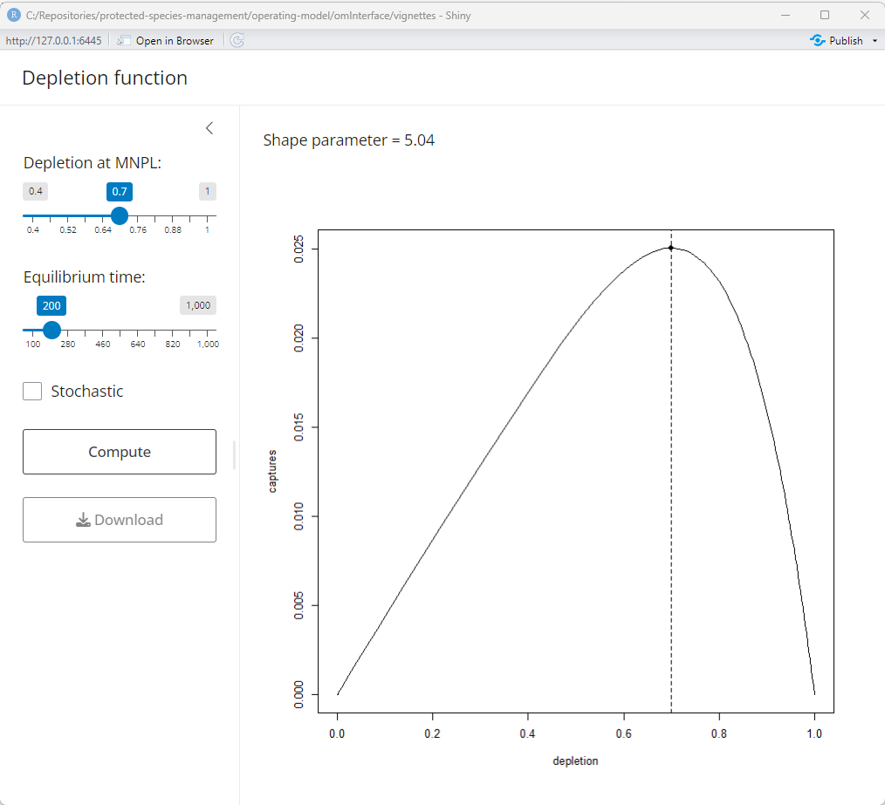

```{r setup, include=FALSE}
knitr::opts_chunk$set(fig.path = 'fig/om-examples-', fig.width = 6, tidy = TRUE, tidy.opts = list(blank = TRUE, width.cutoff = 95), message = FALSE, warning = FALSE, collapse = TRUE, comment = "#>")
```

```{r}
library(om)
library(omInterface)
library(dplyr)
```

```{r}
# setup om-class object
# for cohort-aggregated 
# operating model
om_object <- om(ages = 0:12, samples = 1L, time = 0:200)

# get pars
s_pars   <- c(2.962, 0.20)
b_pars   <- c(9.61, 13.86)
m_values <- 6:8
l_values <- 0.9

# loading pars with calculate r
om_object <- om_object %>% load_pars(list(
    # parametric sampling
    's' = distribution(pars = s_pars, density = "logitnormal", name = "adult survivorship"),
    'b' = distribution(pars = b_pars, density = "beta",        name = "female fecundity"),
    # non-parametric sampling
    'm' = distribution(values = m_values, name = "age at maturity"),
    'v' = distribution(values = m_values, name = "age at selectivity"),
    'l' = distribution(values = l_values, name = "age zero survivorship multiplier")
))

om_object <- om_object %>% load_rmax()

```

```{r, eval = FALSE}
run_mnpl(om_object)
```

```{r, echo = FALSE, out.width="50%", fig.cap="Example shiny output"}

```
